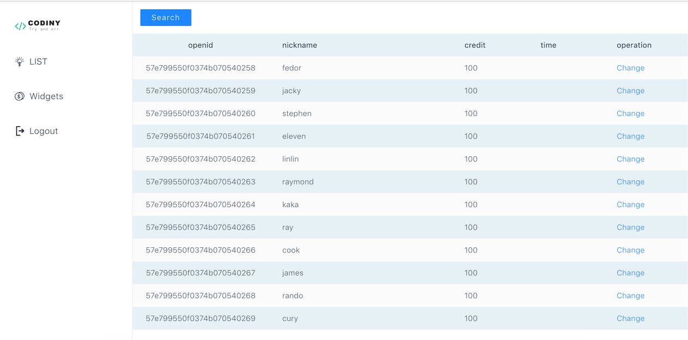

> use vue2.0 & vuex & vue-router to build Single Page Web Application.

# Usage

`npm install`

`npm run dev`

then visit <http://localhost:3000> you will get it.

# Production

 `npm run prod`

# Thanks

1. `webpack` or Hot Module Replacement.
2. `vuejs` for  for the pragmatic innovation.
3. `vuex` for better state management.
4. `stylus` for precompiling styles.
5. ES6 for advanced syntax.
